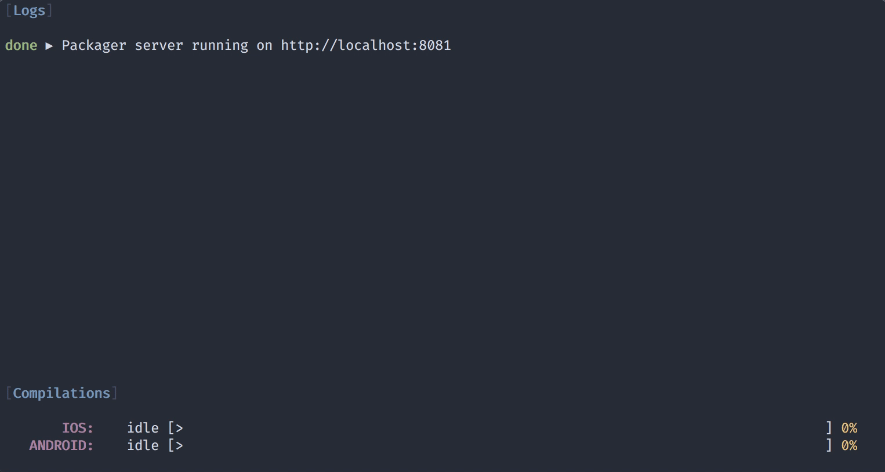

<p align="center">
  
</p>

<p align="center">
  A command line tool for developing React Native apps
</p>

---

[![Build Status][build-badge]][build]
[![MIT License][license-badge]][license]


[![PRs Welcome][prs-welcome-badge]][prs-welcome]
[![Code of Conduct][coc-badge]][coc]

[![Chat][chat-badge]][chat]
[![tweet][tweet-badge]][tweet]

Haul is a drop-in replacement for `react-native` CLI built on open tools like Webpack. It can act as a development server or bundle your React Native app for production.

`@haul-bundler/cli` and other packages under `@haul-bundler` scope are a overhaul of `haul` package __and support only React Native 0.59.0 and above__. If you need to support older versions, please check [`master` branch](https://github.com/callstack/haul/tree/master).

## Features

- Replaces React Native packager to bundle your app
- Access to full webpack ecosystem, using additional loaders and plugins is simple
- Doesn't need watchman, symlinks work nicely
- Helpful and easy to understand error messages

## Packages

| Name                                        | Version                                                                                                            | Description                                                                                                   | Required                                             |
| ------------------------------------------- | ------------------------------------------------------------------------------------------------------------------ | ------------------------------------------------------------------------------------------------------------- | ---------------------------------------------------- |
| `@haul-bundler/cli`                         | [![cli version][version-cli]][package-cli]                                                                         | CLI and commands implementation.                                                                              | Yes                                                  |
| `@haul-bundler/core`                        | [![core version][version-core]][package-core]                                                                      | Core logic and functionality.                                                                                 | Yes (installed with `cli`)                           |
| `@haul-bundler/core-legacy`                 | [![core-legacy version][version-core-legacy]][package-core-legacy]                                                 | Legacy logic from `haul` package                                                                              | Yes (installed with `cli`)                           |
| `@haul-bundler/babel-preset-react-native`   | [![babel-preset-react-native version][version-babel-preset-react-native]][package-babel-preset-react-native]       | Babel preset tweaked for RN 0.59+, which can decrease the bundle size by using only the necessary transforms. | Yes (installed by `init` command)                    |
| `@haul-bundler/basic-bundle-webpack-plugin` | [![basic-bundle-webpack-plugin version][version-basic-bundle-webpack-plugin]][package-basic-bundle-webpack-plugin] | Webpack plugin with tweaks for plain JS bundle.                                                               | Yes (installed with `cli`)                           |
| `@haul-bundler/ram-bundle-webpack-plugin`   | [![ram-bundle-webpack-plugin version][version-ram-bundle-webpack-plugin]][package-ram-bundle-webpack-plugin]       | Webpack plugin for RAM bundle support.                                                                        | Yes (installed with `cli`)                           |
| `@haul-bundler/preset-0.59`                 | [![preset-0.59 version][version-preset-0.59]][package-preset-0.59]                                                 | Preset with configuration tweaked for RN 0.59.                                                                | Yes (installed by `init` command when using RN 0.59) |
| `@haul-bundler/preset-0.60`                 | [![preset-0.60 version][version-preset-0.60]][package-preset-0.60]                                                 | Preset with configuration tweaked for RN 0.60.                                                                | Yes (installed by `init` command when using RN 0.60) |
| `@haul-bundler/inspector`                   | [![inspector version][version-inspector]][package-inspector]                                                       | Haul inspector with `haul-inspector` binary.                                                                  | No (optional).                                       |
| `@haul-bundler/inspector-events`            | [![inspector-events version][version-inspector-events]][package-inspector-events]                                  | Shared logic between `cli` and Haul `inspector`.                                                              | Yes (installed with `cli`)                           |

## Getting started

Start by adding Haul as a dependency to your React Native project (use `react-native init MyProject` to create one if you don't have a project):

```bash
yarn add --dev @haul-bundler/cli

# Traditionalist? No problem:
npm install --save-dev @haul-bundler/cli
```

To configure your project to use haul, run the following:

```bash
yarn haul init
# npm >= 5.2.0 :
npx haul init
# npm < 5.2.0 :
npm install -g npx
npx haul init
```

This will automatically add the configuration needed to make Haul work with your app, e.g. add `haul.config.js` to your project, which you can customize to add more functionality.

Next, you're ready to start the development server:

```bash
yarn haul start
# Or:
npx haul start
```

Finally, reload your app to update the bundle or run your app just like you normally would:

```bash
react-native run-ios
```

<p align="center">
  
</p>

## Documentation

Check out the docs to learn more about available commands and tips on customizing the webpack configuration.

1. [CLI Commands](docs/CLI%20Commands.md)
2. [Configuration](docs/Configuration.md)
3. [Recipes](docs/Recipes.md)
4. [Migration guide](docs/Migration.md)

<!-- ### Hot Module Replacement

__Hot Module Replacement is an experimental feature and it's disabled by default.__

Please refer to the [Setup guide](./docs/HMR_Setup.md). -->

## Limitations

Haul uses a completely different architecture from React Native packager, which means there are some things which don't work quite the same.

* Delta Bundles (RN 0.52+) have minimal support
* Existing `react-native` commands
* No support for Hot Module Replacement

The following features are **unlikely to be supported** in the future:

- Haste module system: use something like [babel-plugin-module-resolver](https://github.com/tleunen/babel-plugin-module-resolver) instead
- Transpile files under `node_modules`: transpile your modules before publishing, or configure webpack not to ignore them

<!-- badges -->
[build-badge]: https://img.shields.io/circleci/project/github/callstack/haul/master.svg?style=flat-square
[build]: https://circleci.com/gh/callstack/haul
[license-badge]: https://img.shields.io/npm/l/@haul-bundler/cli.svg?style=flat-square
[license]: https://github.com/callstack/haul/blob/master/LICENSE
[prs-welcome-badge]: https://img.shields.io/badge/PRs-welcome-brightgreen.svg?style=flat-square
[prs-welcome]: http://makeapullrequest.com
[coc-badge]: https://img.shields.io/badge/code%20of-conduct-ff69b4.svg?style=flat-square
[coc]: https://github.com/callstack/haul/blob/master/CODE_OF_CONDUCT.md
[chat-badge]: https://img.shields.io/discord/426714625279524876.svg?style=flat-square&colorB=758ED3
[chat]: https://discord.gg/zwR2Cdh
[tweet-badge]: https://img.shields.io/badge/tweet-%23haul-blue.svg?style=flat-square&colorB=1DA1F2&logo=data:image/png;base64,iVBORw0KGgoAAAANSUhEUgAAABgAAAAUCAYAAACXtf2DAAAAAXNSR0IArs4c6QAAAaRJREFUOBGtlM8rBGEYx3cWtRHJRaKcuMtBSitxkCQ3LtzkP9iUUu5ODspRHLhRLtq0FxeicEBC2cOivcge%2FMgan3fNM8bbzL4zm6c%2BPT%2Fe7%2FO8887svrFYBWbbtgWzsAt3sAcpqJFxxF1QV8oJFqFPFst5dLWQAT87oTgPB7DtziFRT1EA4yZolsFkhwjGYFRO8Op0KD8HVe7unoB6PRTBZG8IctAmG1xrHcfkQ2B55sfI%2ByGMXSBqV71xZ8CWdxBxN6ThFuECDEAL%2Bc9HIzDYumVZ966GZnX0SzCZvEqTbkaGywkyFE6hKAsBPhFQ18uPUqh2ggJ%2BUor%2F4M%2F%2FzOC8g6YzR1i%2F8g4vvSI%2ByD7FFNjexQrjHd8%2BnjABI3AU4Wl16TuF1qANGll81jsi5qu%2Bw6XIsCn4ijhU5FmCJpkV6BGNw410hfSf6JKBQ%2FUFxHGYBnWnmOwDwYQ%2BwzdHqO75HtiAMJfaC7ph32FSRJCENUhDHsLaJkL%2FX4wMF4%2BwA5bgAcrZE4sr0Cu9Jq9fxyrvBHWbNkMD5CEHWTjjT2m6r5D92jfmbbKJEWuMMAAAAABJRU5ErkJggg%3D%3D
[tweet]: https://twitter.com/intent/tweet?text=Check%20out%20Haul!%20https://github.com/callstack/haul%20%F0%9F%91%8D

[version-cli]: https://img.shields.io/npm/v/@haul-bundler/cli.svg?style=flat-square
[package-cli]: https://www.npmjs.com/package/@haul-bundler/cli
[version-core]: https://img.shields.io/npm/v/@haul-bundler/core.svg?style=flat-square
[package-core]: https://www.npmjs.com/package/@haul-bundler/core
[version-core-legacy]: https://img.shields.io/npm/v/@haul-bundler/core-legacy.svg?style=flat-square
[package-core-legacy]: https://www.npmjs.com/package/@haul-bundler/core-legacy
[version-babel-preset-react-native]: https://img.shields.io/npm/v/@haul-bundler/babel-preset-react-native.svg?style=flat-square
[package-babel-preset-react-native]: https://www.npmjs.com/package/@haul-bundler/babel-preset-react-native
[version-basic-bundle-webpack-plugin]: https://img.shields.io/npm/v/@haul-bundler/basic-bundle-webpack-plugin.svg?style=flat-square
[package-basic-bundle-webpack-plugin]: https://www.npmjs.com/package/@haul-bundler/basic-bundle-webpack-plugin
[version-ram-bundle-webpack-plugin]: https://img.shields.io/npm/v/@haul-bundler/ram-bundle-webpack-plugin.svg?style=flat-square
[package-ram-bundle-webpack-plugin]: https://www.npmjs.com/package/@haul-bundler/ram-bundle-webpack-plugin
[version-inspector]: https://img.shields.io/npm/v/@haul-bundler/inspector.svg?style=flat-square
[package-inspector]: https://www.npmjs.com/package/@haul-bundler/inspector
[version-inspector-events]: https://img.shields.io/npm/v/@haul-bundler/inspector-events.svg?style=flat-square
[package-inspector-events]: https://www.npmjs.com/package/@haul-bundler/inspector-events
[version-preset-0.59]: https://img.shields.io/npm/v/@haul-bundler/preset-0.59.svg?style=flat-square
[package-preset-0.59]: https://www.npmjs.com/package/@haul-bundler/preset-0.59
[version-preset-0.60]: https://img.shields.io/npm/v/@haul-bundler/preset-0.60.svg?style=flat-square
[package-preset-0.60]: https://www.npmjs.com/package/@haul-bundler/preset-0.60
