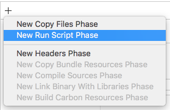
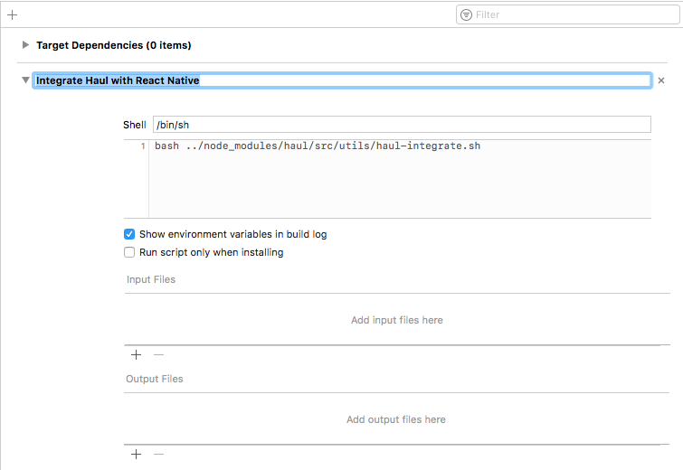

# Configuring your project

## Integrating with Xcode

Add a new Run Script phase to your project's main target.

Click on its default "Run Script" label to set its name to something like "Integrate Haul with React Native".

Add the following command to the script:

`bash ../node_modules/haul/src/utils/haul-integrate.sh`

Usually, a React Native project has a run script phase that runs `react-native-xcode.sh`. This phase is added during initial integration with RN. Due to the fact that `haul-integrate.sh` rewrites parts of `react-native-xcode.sh`, the new build phase should be run before the existing build phase:

## Integrating with Gradle

Running `haul init` will set up everything for you.
